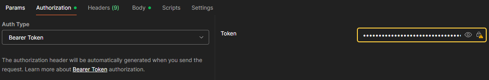

# API Acadêmica

Este projeto é uma API construída como parte de um assessment da faculdade, utilizando Spring Boot.
Ela tem como objetivo gerenciar alunos, professores, disciplinas e matrículas.

## Funcionalidades

- Cadastro e listagem de alunos
- Cadastro e listagem de disciplinas
- Cadastro e listagem de matrículas
- Autenticação de professores com JWT

## Banco de Dados

O projeto utiliza banco de dados relacional (PostgreSQL ou H2 para testes).
Configuração no application.properties:

- spring.datasource.url= jdbc:postgresql://localhost:5432/academico
- spring.datasource.username= academico_user
- spring.datasource.password= academico_pass

→ Para ambiente de testes, o H2 é usado automaticamente. 
<br>Acesse o console em: http://localhost:8080/h2-console

## Testando no Postman

### 1- Autenticar professor

POST http://localhost:8080/api/auth/login

Body (JSON):
```bash
{
  "email": "joao.silva@example.com",
  "senha": "12345"
}
```
Resposta → retorna um token JWT. 

E o caso acima é um exemplo já existente, mas é possível criar um novo cadastro de professor, seguindo exemplo abaixo:

POST http://localhost:8080/api/auth/register

```bash
{
  "email": "seu_email@example.com",
  "senha": "sua_senha"
}
```
### 2- Usar o token nas requisições

Adicione no Postman em Headers. Authorization: Bearer Token SEU_TOKEN


### 3- Exemplos de outros endpoints

- POST /api/alunos → Cadastrar aluno
- GET /api/alunos → Listar alunos
- POST /api/disciplinas → Cadastrar disciplina
- GET /api/disciplinas → Listar disciplinas
- POST /api/matriculas → Realizar matrícula
- GET /api/matriculas → Visualizar todos os alunos matrículados


### 4- Testes Automatizados

O projeto conta com testes unitários e de integração, com cobertura acima de 75% no Jacoco.

Para rodar:
```bash

 mvn test
 mvn jacoco:report
```

Relatório disponível em → target/site/jacoco/index.html
